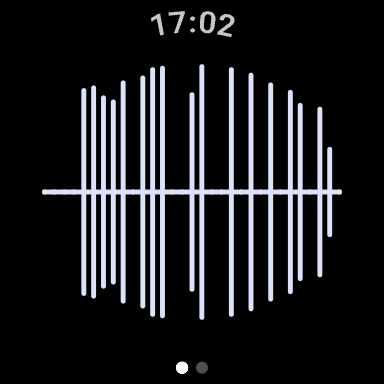
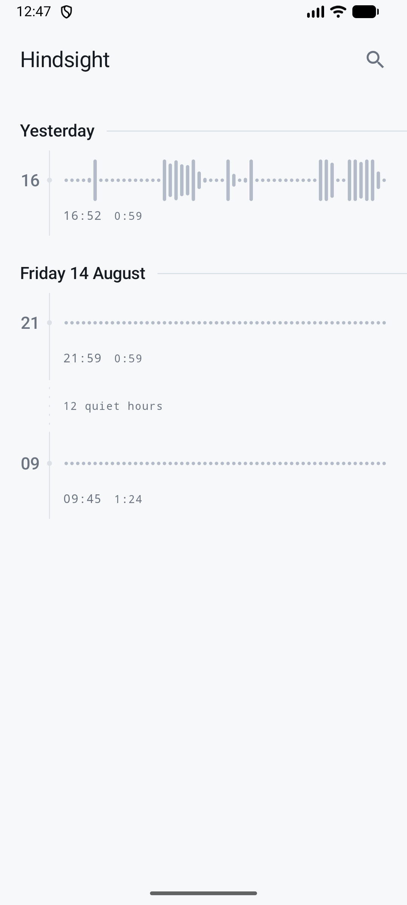
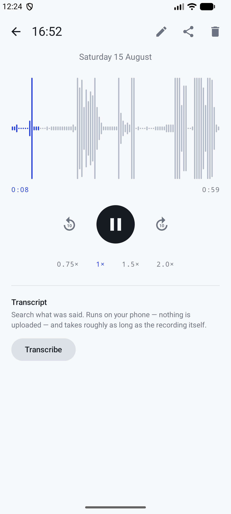
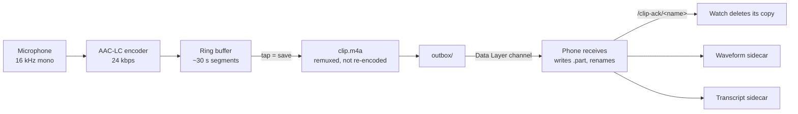
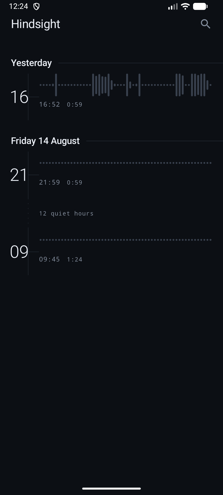
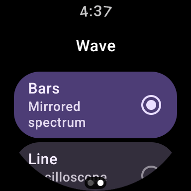

<div align="center">

# Hindsight

**A watch that is always listening, and remembers only the last few minutes.**


</div>

## What is this?

Hindsight records continuously on a Wear OS watch into a fixed-size ring buffer, keeping
only the last *X* minutes and throwing the rest away. When something worth keeping has
just been said, you tap the watch and that window is saved and sent to your phone, where
you can scrub it, search it and keep it.

It solves the problem that you only know a moment mattered *after* it happened. The watch
is a buffer, not an archive — a clip is deleted from it the moment the phone confirms the
clip is safely on disk.

<div align="center">

&nbsp;&nbsp;

&nbsp;&nbsp;

</div>

## Quick start

Requires **JDK 17** and the Android SDK (compileSdk 35). `adb` lives at
`~/Library/Android/sdk/platform-tools/adb` on macOS if it isn't on your `PATH`.

```bash
git clone https://github.com/jagenaujagenau/hindsIght.git
cd hindsIght
./gradlew :wear:assembleDebug :mobile:assembleDebug
```

Install the **phone app first** — it advertises the capability the watch looks for:

```bash
adb -s <phone-serial>  install -r mobile/build/outputs/apk/debug/mobile-debug.apk
adb -s <watch-serial>  install -r wear/build/outputs/apk/debug/wear-debug.apk
```

Use the **debug** APKs. The release outputs are unsigned, and more importantly the Data
Layer only bridges two apps that share an `applicationId` *and* a signing key — debug
builds from one machine share `~/.android/debug.keystore`, so pairing works by default.

On the watch: grant the microphone permission. Recording starts as soon as the app opens.

| Gesture | Action |
|---|---|
| Tap | Save the last window |
| Long-press | Stop listening |
| Tap while stopped | Resume |
| Swipe | Settings |

## How it works



**Nothing is re-encoded when you save.** The AAC frames the encoder already produced are
copied straight into an MP4 container. IO scales with clip length, without the CPU cost of
re-encoding. Trimming is exact to a 64 ms frame. A clip is built under a `.part` name,
finalised and flushed to disk before it becomes uploadable; only then does the watch
confirm with a haptic. Collision-safe names keep rapid saves distinct.

**Transport success is not delivery.** `sendFile` resolves when bytes reach the local
Bluetooth buffer, which says nothing about the phone. The watch therefore deletes nothing
until the phone sends `/clip-ack/<filename>`, after the file is renamed into place. A
transfer that dies costs a retry, not a recording.

**Storage scales with the setting, not the maximum.** The ring is sized from the current
retention, so a 1-minute user pays ~0.3 MB rather than the 10.6 MB a 60-minute window needs.

| Retention | On watch |
|---|---|
| 1 min | ~0.3 MB |
| 5 min | ~1.0 MB |
| 15 min | ~2.7 MB |
| 30 min | ~5.4 MB |
| 60 min | ~10.6 MB |

## The two apps

**Watch** — the main face is a full-screen save target, with listening/buffer status,
action hints, and feedback that distinguishes saved-on-watch from delivered-to-phone.
Swipe for Start/Stop and retention controls; Appearance contains four wave styles,
six colours, and three **display-only** sensitivity settings. Capture, encode and disk
writes share a thread paced by blocking `AudioRecord.read`. Status updates roughly once
per second; waveform metering runs only while its page has an interactive collector.
Audio targets are interpolated at display-frame cadence with fast attack and soft release;
the line uses rounded curves, and pulse rings respond in radius and brightness. Drawing
settles completely in silence, pauses off-screen, and respects system animation duration scale.
A tile offers one-tap save and its latest outcome, and an OngoingActivity chip keeps the
running recorder visible. Tile Start opens the app to obtain microphone access safely.

Start/Stop intent is persisted by the service for every entry point. Capture failures
release the wake lock and recording notification, with an explicit tap-to-retry state
rather than an automatic restart loop. Reconnect/manual sync wakes an immediate drain
independently of the single delayed retry; transfers are serialized.

**Phone** — the archive, laid out as a time axis rather than a list. Each clip is drawn as
its own waveform, so you recognise a recording by its shape; stretches where nothing was
captured are drawn as *"12 quiet hours"* rather than closed up. Tapping a clip grows its
waveform into the player via a shared element. Scrub, skip, change speed, rename, share,
and delete with undo.

<div align="center">

&nbsp;&nbsp;

</div>

**Transcription** is on-device via `SpeechRecognizer`, so no audio leaves the phone. It is
positioned as a search aid, not a record — see [Known gaps](#known-gaps).

## Project structure

```
docs/
  screenshots/            Real captures from a Pixel Watch 2 and Pixel 10
gradle/
  wrapper/
  libs.versions.toml      Single source of dependency versions
mobile/                   Phone app: archive, player, transcripts
  src/main/java/…/audio/        Waveform envelope extraction, PCM decode
  src/main/java/…/data/         ClipStore — files plus sidecars, no database
  src/main/java/…/player/       MediaPlayer wrapper with real seeking
  src/main/java/…/sync/         Receives clips, acknowledges, answers sync requests
  src/main/java/…/transcribe/   On-device speech, chunking, transcript stitching
  src/main/java/…/ui/           Timeline, player, theme
shared/                   The Data Layer contract both apps compile against
wear/                     Watch app: capture, ring buffer, transfer
  src/main/java/…/audio/        AudioRecord → AAC → ring buffer → clip assembly
  src/main/java/…/service/      Foreground recorder service
  src/main/java/…/sync/         Outbox, upload worker, ack and reconnect listener
  src/main/java/…/tile/         One-tap save tile
  src/main/java/…/ui/           The wave
build.gradle.kts
settings.gradle.kts
```

Both modules use the applicationId `earth.diego.hindsight`. That is deliberate and
required — the Data Layer pairs apps by applicationId and signing key, not by module.

## Testing

```bash
./gradlew :wear:testDebugUnitTest :mobile:testDebugUnitTest
```

52 unit tests, covering audio retention, save publication, lifecycle serialization,
sync queue draining, status presentation, and phone metadata:

| Suite | Covers |
|---|---|
| `AdtsTest` | ADTS header round-trip; 16 kHz mono AAC-LC framing |
| `SegmentRingTest` | Duration-based eviction, frequent short saves, retention shrink, pinned segments |
| `RingRecorderLifecycleTest` | Nonblocking shutdown and no overlapping restart, using controlled threads |
| `AtomicClipTest` | Final-file visibility, failed/empty builds, overwrite protection |
| `UploadDrainTest` | Newly saved clips during transfer, serialization, missing acks, cancellation |
| `RecorderBusTest` / `RecorderPresentationTest` | Replayable outcomes, matching acks, truthful feedback |
| `WaveformMotionTest` | Interpolation, refresh-rate independence, interruption, settling, animation scale, safe inputs |
| `ClipStoreTest` | Legacy and collision-safe filenames retain phone metadata |
| `TranscriptStitcherTest` | Splicing overlapping transcript chunks without stutter |
| `TimelineTest` | Hour marks, quiet stretches, never spanning a day boundary |

Microphone/codec behavior, service foreground/wake-lock integration, WorkManager timing,
Data Layer transfer, and UI rendering still need real hardware. The lifecycle test replaces
only the capture thread body; it does not simulate a microphone. See
[validation and profiling](docs/validation.md) for the device checklist.

## Known gaps

- **Transcription recall is partial.** Measured on a Pixel 10, the on-device recogniser
  stops at the first substantial silence, so audio is chunked with overlap. Different
  chunk boundaries surface different passages. It reliably finds *some* of what was said —
  good for locating roughly when something was discussed, not a verbatim record. An hour of
  audio is roughly 40 minutes of background work.
- **The Gradle wrapper is on 9.0** while AGP is 8.7.3, which is outside AGP's documented
  support matrix. It currently builds clean, but it is untested ground.
- **Release builds are unsigned** and lint is disabled for them: AGP 8.7.3's bundled lint
  throws `IncompatibleClassChangeError` against the newer androidx artifacts. `:wear:lintDebug`
  also encounters this toolchain failure; it is not a passing validation gate.
- No CI, and no signing configuration for distribution.

## License

No licence has been chosen, so default copyright applies and no permissions are granted.
Add a `LICENSE` file if you want that to change.
